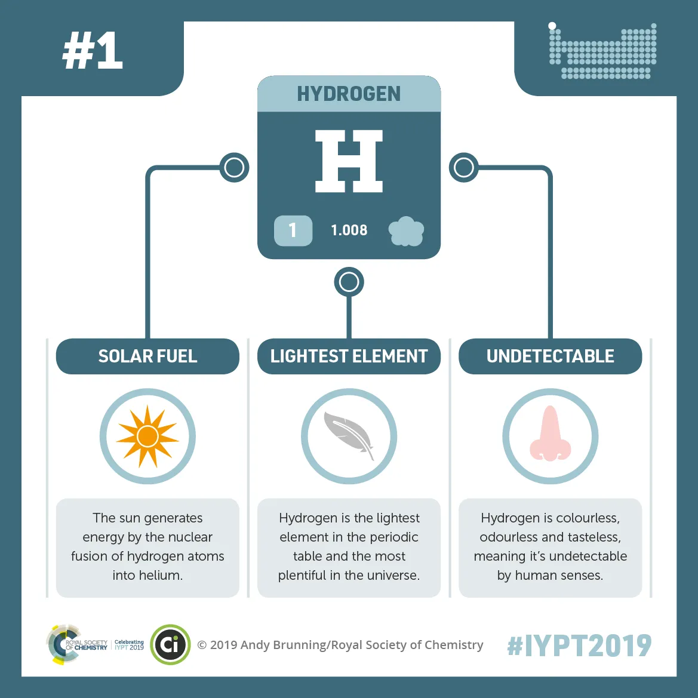
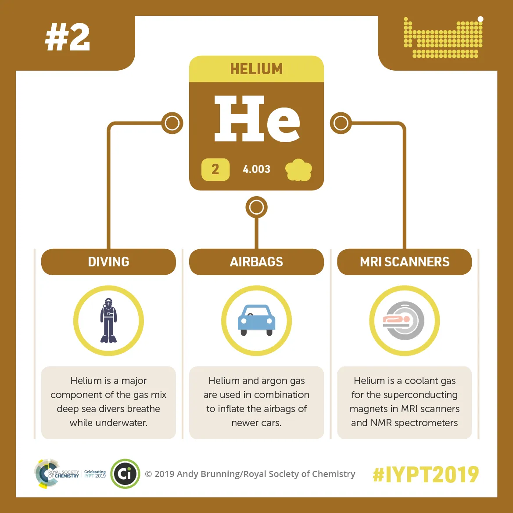

# Periodic Table App

This is a regular paragraph.

<table>
    <tr>
        <td>Foo</td>
    </tr>
</table>

This is another regular paragraph.

A single backtick in a code span: `` ` ``

A backtick-delimited string in a code span: `` `foo` ``

``There is a literal backtick (`) here.``

Use the `printf()` function.

*single asterisks*

_single underscores_

**double asterisks**

__double underscores__


See my [About](/about/) page for details. 


This is [an example](http://example.com/ "Title") inline link.

[This link](http://example.net/) has no title attribute.

| Left | Center | Right |
|:-----|:------:|------:|
|aaa   |bbb     |ccc    |
|ddd   |eee     |fff    |

 A | B 
---|---
123|456


A |B 
--|--
12|45


```ruby
require 'redcarpet'
markdown = Redcarpet.new("Hello World!")
puts markdown.to_html
```

*   Red
*   Green
*   Blue


+   Red
+   Green
+   Blue

-   Red
-   Green
-   Blue


> ## This is a header.
> 
> 1.   This is the first list item.
> 2.   This is the second list item.
> 
> Here's some example code:
> 
>     return shell_exec("echo $input | $markdown_script");


# This is an H1 #
## This is an H2 ##
### This is an H3 ######

# This is an H1
## This is an H2
###### This is an H6

> This is the first level of quoting.
>
> > This is nested blockquote.
>
> Back to the first level.


> This is a blockquote with two paragraphs. Lorem ipsum dolor sit amet,
> consectetuer adipiscing elit. Aliquam hendrerit mi posuere lectus.
> Vestibulum enim wisi, viverra nec, fringilla in, laoreet vitae, risus.
> 
> Donec sit amet nisl. Aliquam semper ipsum sit amet velit. Suspendisse
> id sem consectetuer libero luctus adipiscing.


<h1/>   

  



